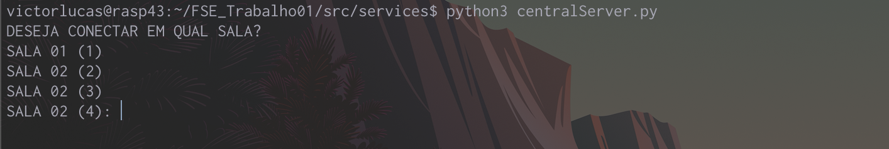
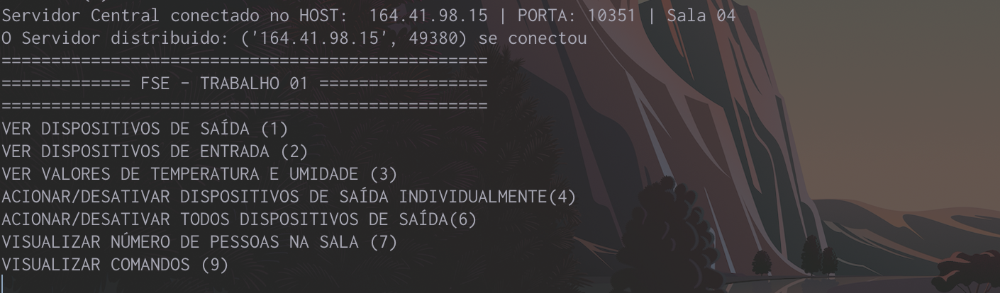
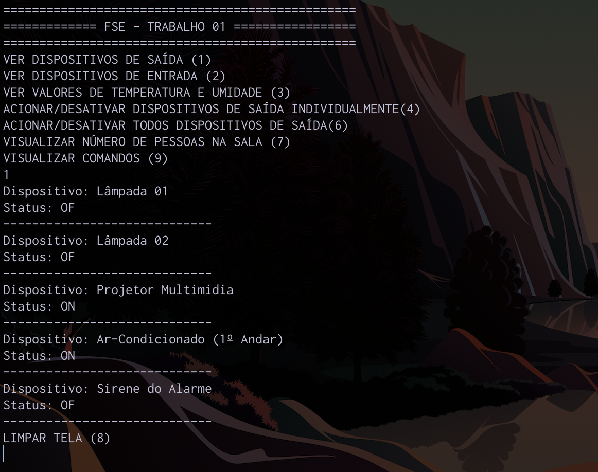
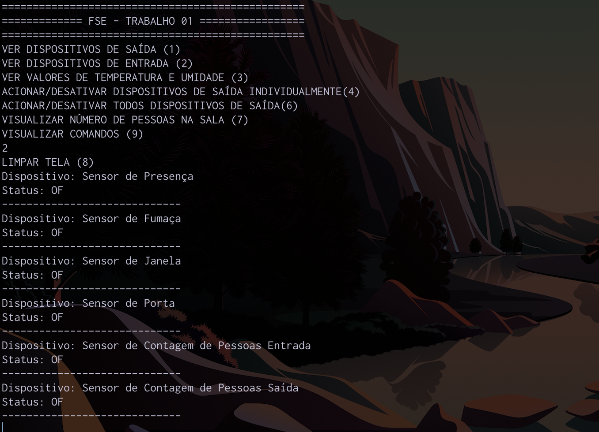
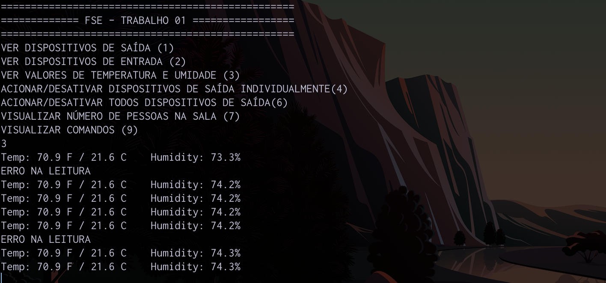
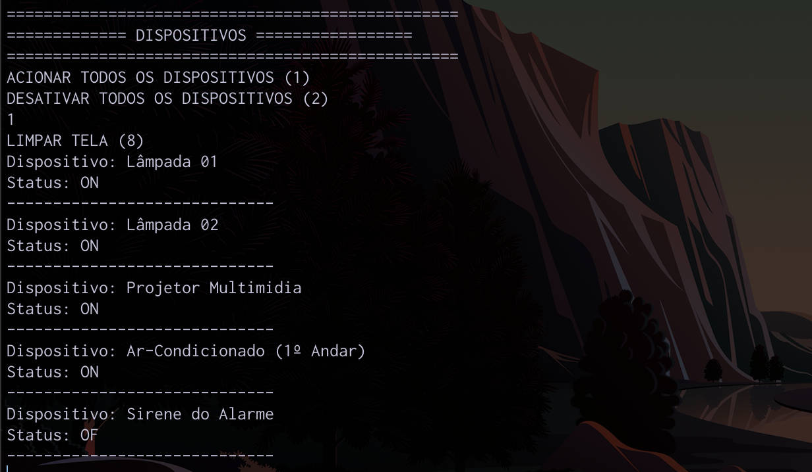
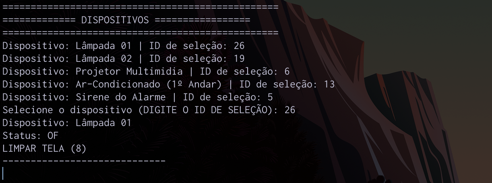
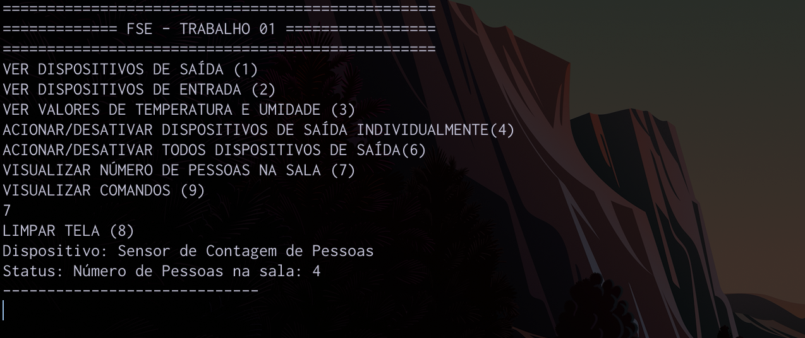
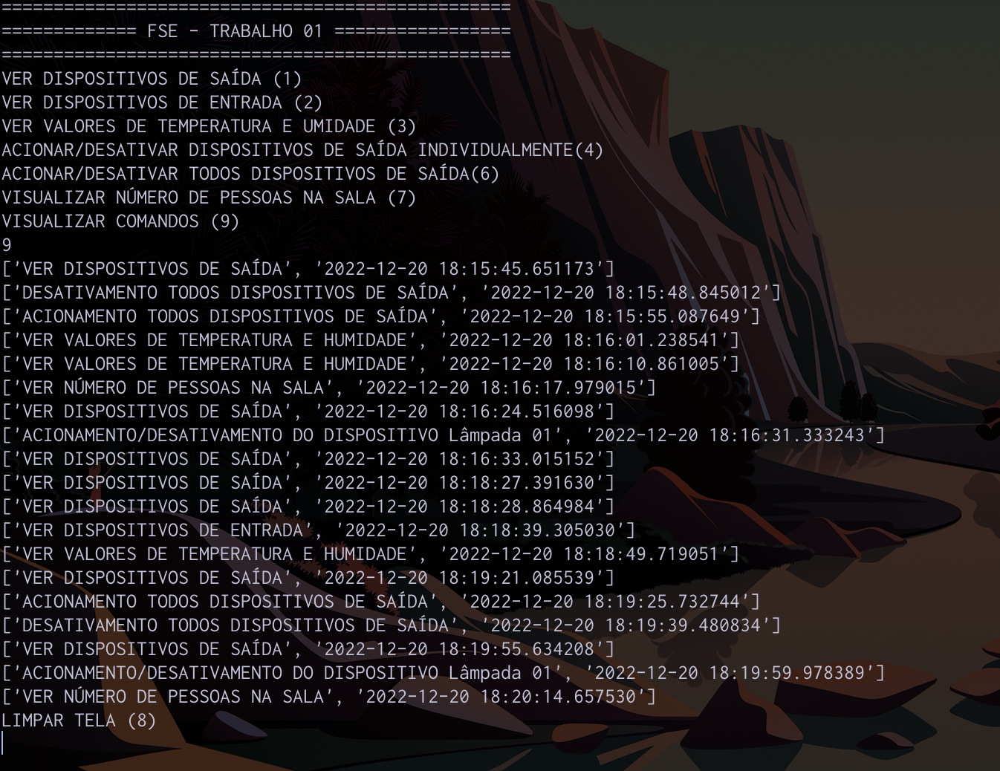

# Trabalho 1 (2022-2)
Trabalho 1 da disciplina de Fundamentos de Sistemas Embarcados (2022/2)

## Objetivo
Este trabalho tem por objetivo a criação de um sistema distribuído de automação predial para monitoramento e acionamento de sensores e dispositivos de um prédio com múltiplas salas. O sistema deve ser desenvolvido para funcionar em um conjunto de placas Raspberry Pi com um servidor central responsável pelo controle e interface com o usuário e servidores distribuídos para leitura e acionamento dos dispositivos. Dentre os dispositivos envolvidos estão o monitoramento de temperatura e umidade, sensores de presença, sensores de fumaça, sensores de contagem de pessoas, sensores de abertura e fechamento de portas e janelas, acionamento de lâmpadas, aparelhos de ar-condicionado, alarme e aspersores de água em caso de incêndio.

Veja mais detalhes clicando [aqui](https://gitlab.com/fse_fga/trabalhos-2022_2/trabalho-1-2022-2#trabalho-1-2022-2).

## Dependências
Este trabalho foi desenvolvido usando a linguagem [Python](https://www.python.org/downloads/) em sua versão 3.
- Bibliotecas auxiliares:
    - [RPI.GPIO](https://pypi.org/project/RPi.GPIO/): Responsável por permitir acesso a placa.
    - [Adafruit-DHT](https://pypi.org/project/Adafruit-DHT/): Responsável por acessar os sensores de temperatura. 

## Detalhes da implementação
- O projeto conta com a implementação de um servidor central e um distribuído que usam o protocolo de comunicação TCP/IP.
- O projeto conta com a implementação de Threads para recebimento e envio de mensagens entre servidores. 
- O projeto realiza o consumo das informações de configuração a partir de um arquivo json.
- O projeto tem as seguintes funcionalidades:
    - Visualizar estado dos dispositivos de saída (Lâmpadas, Projetores e Ar-condicionado)
    - Visualizar estado dos disposivitos de entrada (Sensores de presença, fumaça, porta, janela e contagem de pessoas )
    - Visualizar a temperatura e humidade atual a cada 2 segundos.
    - Acionar dispositivos de saída (Lâmpadas, Projetores e Ar-condicionado) individualmente. 
    - Acionar/Desativar todos os dispositivos de entrada (Lâmpadas, Projetores e Ar-condicionado).
    - Salvar comandos em arquivo CSV com dia e hora, alêm de disponibilizar a visualização deles no prompt de comando. 
    - Visualizar número de pessoas na sala escolhida. 
    - Acionamento do alarme por meio da ativação dos sensores de presença, porta ou janela. 
## Possíveis melhorias
- O servidor central está se conectando somente a um servidor distribuído (Conectando somente a uma sala por vez). 
- As rotinas de acionamento do alarme não estão sendo retornadas ao servidor central em tempo real, somente é exibida no distribuído (para visualizar no servidor central é necessário acionar o comando de ver o estado dos dispositivos. 

## Instruções/Como rodar 
- Acessar a placa responsável pela sala que será testada
    -   Para o exemplo do vídeo foi usado a RASP43 e SALA 04
- Ter as dependências devidamente instaladas no ambiente de teste
- Acessar a pasta services
- Rodar o servidor central:
```bash
    python3 centralServer.py
```
- Selecionar a sala desejada selecionando digitando 1, 2, 3 ou 4
- Rodar o servidor ditribuido:
```bash
    python3 ditriServer.py
```
- Selecionar a sala desejada selecionando digitando 1, 2, 3 ou 4(A mesma selecionada no servidor central)
- Digitar algum dos comando exibidos no menu.

## Observações
É necessário estar na placa responsável pela sala usada. 
- Para o exemplo do vídeo foi usado a RASP43 e SALA 04
- CRTL + C Interrompe a exibição de temperatura e umidade (Apertando a tecla 8 o menu inicial volta)

## Screenshots 
#### Escolha de Salas no servidor central


#### Log de recebimento de conexão e menu inicial


#### Log de recebimento de conexão e menu inicial


#### Visualização de estados dos dispiositivos de saída (Lâmpadas, ar-condicionado e projetor)


#### Visualização de estados dos dispiositivos de entrada (Sensores)


#### Visualização de temperatura e umidade a cada 2s


#### Acionamento/Desativamento de todos os dispositivos de saída


#### Acionamento/Desativamento de um dispositivo individualmente


#### Número de pessoas na sala


#### Visualização dos comandos executados


## Vídeo de apresentação
- Primeira opção: Clique [aqui](https://youtu.be/ukWc5g4RHE4) para ver no Youtube.
- Segunda opção: Clique [aqui](https://unbbr.sharepoint.com/sites/MinhasGravaes431/_layouts/15/stream.aspx?id=%2Fsites%2FMinhasGravaes431%2FDocumentos%20Compartilhados%2FGeneral%2FRecordings%2FFSE%20%2D%20Trabalho%2001%2D20221220%5F190142%2DMeeting%20Recording%2Emp4) para ver no Sharepoint.
- Terceira opção: O vídeo está disponível na pasta assets com o nome FSE-Trabalho01.mp4
